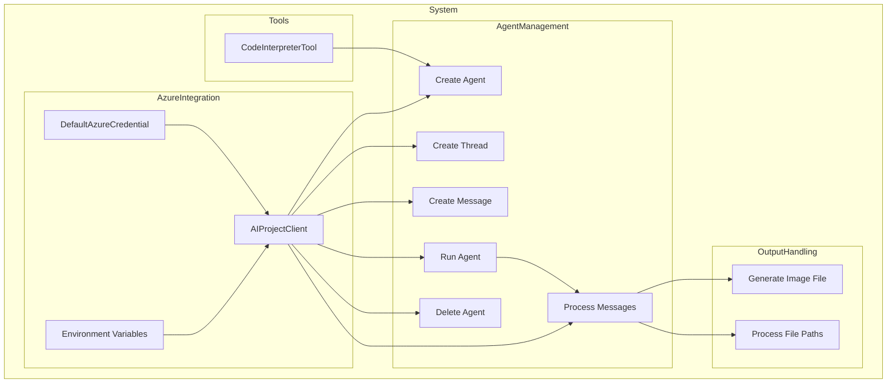

    

    <b>Automatic Architecture Diagrams from Code</b> 
    <a href="https://github.com/swark-io/swark">GitHub</a> • <a href="https://swark.io">Website</a> • <a href="mailto:contact@swark.io">Contact Us</a>

## Usage Instructions

1. **Render the Diagram**: Use the links below to open it in Mermaid Live Editor, or install the [Mermaid Support](https://marketplace.visualstudio.com/items?itemName=bierner.markdown-mermaid) extension.
2. **Recommended Model**: If available for you, use `claude-3.5-sonnet` [language model](vscode://settings/swark.languageModel). It can process more files and generates better diagrams.
3. **Iterate for Best Results**: Language models are non-deterministic. Generate the diagram multiple times and choose the best result.

## Generated Content
**Model**: GPT-4o - [Change Model](vscode://settings/swark.languageModel)  
**Mermaid Live Editor**: [View](https://mermaid.live/view#pako:eNqFVMtuwjAQ_JXIZ_iBHCoh0gcHVFRQLwkHkyyJK8eO_KhEEf_ejR0EMW4aCbGeGe-u15OcSSkrICkpRK1o1yS7rBAJPtoePLA9aQOtB0fE4scqWAkDuDRMipukfxy75AyEyRerjZJfUBq_3seUCiqkGOV5BkdquQngYNOz-P6kSuf4z5QULYoSBBg9cNB3WhBVrPUa9WsqaA39zqCfnsTC7lC5C8CDQQ-7BrkqVHo0kK5BaywWagd4H2ngw4ocf9HCwzYcaokRE3U-hFdGxzJmwMEVd8HjkeKj2knJ9TjbEh3T37vqFOZRebDud_yb9t2azpo3KiqO_Y_zr1o8wisI8L7KhxA8kbwwHk6shzbUNJGJ9FTSc1FXuMCHg6OS-fzp3ryeDMw4JXKAF9wbKS4ZWyiuCbwzUQv9MpniNp6JJFebeElwt3-eayg_Ve0BduLgsqekj7dcCDIjLaiWsgq_YeeCmAbf6IKkSUEq_x0pyAVFtqvQQRmjaL-WpEZZmBFqjdyeRHldK2nrhqRHyjVcfgGWVqfs) | [Edit](https://mermaid.live/edit#pako:eNqFVMtuwjAQ_JXIZ_iBHCoh0gcHVFRQLwkHkyyJK8eO_KhEEf_ejR0EMW4aCbGeGe-u15OcSSkrICkpRK1o1yS7rBAJPtoePLA9aQOtB0fE4scqWAkDuDRMipukfxy75AyEyRerjZJfUBq_3seUCiqkGOV5BkdquQngYNOz-P6kSuf4z5QULYoSBBg9cNB3WhBVrPUa9WsqaA39zqCfnsTC7lC5C8CDQQ-7BrkqVHo0kK5BaywWagd4H2ngw4ocf9HCwzYcaokRE3U-hFdGxzJmwMEVd8HjkeKj2knJ9TjbEh3T37vqFOZRebDud_yb9t2azpo3KiqO_Y_zr1o8wisI8L7KhxA8kbwwHk6shzbUNJGJ9FTSc1FXuMCHg6OS-fzp3ryeDMw4JXKAF9wbKS4ZWyiuCbwzUQv9MpniNp6JJFebeElwt3-eayg_Ve0BduLgsqekj7dcCDIjLaiWsgq_YeeCmAbf6IKkSUEq_x0pyAVFtqvQQRmjaL-WpEZZmBFqjdyeRHldK2nrhqRHyjVcfgGWVqfs)

